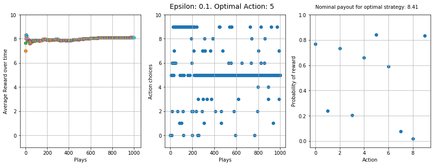
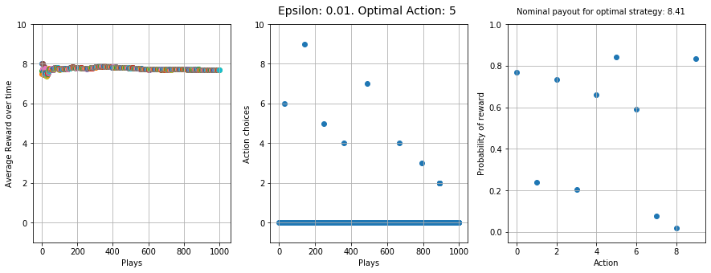
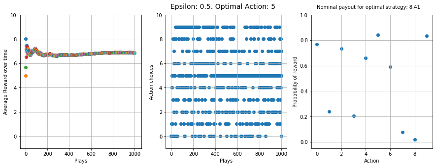

# Developing and messing around with RL agents

I wrote this notebook because I couldn't find a "Hello World" equivalent for Reinforcement Learning .. so here goes!

## N-armed bandit simulations: 

Keeping the reward probabilities the same, but tweaking epsilon (probability of exploration)

#### Typical epsilon

#### Low epsilon (slow learner)

#### High epsilon (50/50 exploration/exploitation split)

